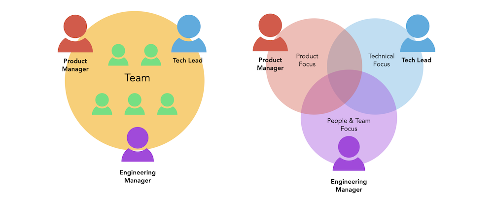

* Draft: 2021-07-01 (Thu)

# Technical Lead

## Summary

A Tech Lead leads the technical direction and quality for the team. Added responsibilities may exist depending on the specific team.

## Google search: what is tech lead

* [A Guide to Technical Leads: What They Do and How to Become One](https://www.indeed.com/career-advice/finding-a-job/technical-lead)

> At some point in your software development career, you may be ready for additional responsibilities. For experienced software developers who exhibit leadership skills and stay up to date on the latest technology, it may be beneficial to consider pursuing a technical lead position. Becoming a technical lead is a great way to combine your passion for technology with your management skills, and if this career interests you, it is important to understand what it entails.
>

* [The Definition of a Tech Lead](https://www.patkua.com/blog/the-definition-of-a-tech-lead/), Pat Kua, 2020-05-28.

  > A Tech Lead is a software engineer responsible for leading a team and alignment of the technical direction.
  >
  > Providing a strong technical direction involves 
  >
  > * establishing a technical vision, 
  > * resolving technical disagreements and 
  > * managing the technical quality of team deliverables. 
  >
  > Effective technical leadership ensures the team 
  >
  > * uses appropriate engineering practices (such as CD or automated testing), 
  > * invests in continual improvements to tooling or technical debt, and 
  > * that the system evolves to meet its changing needs and environment.

> Sometimes team leadership is shared but rarely technical leadership. 
>
> A Tech Lead may co-lead a team with other roles like 
>
> * a Product Manager or 
> * Engineering Manager/Team Lead. 
>
> Where a Product Manager focuses on the “What“, the Tech Lead focuses on the “How.” Where the Engineering Manager/Team Lead focuses on “People and Team Growth“, the Tech Lead focuses on “Technical Growth” of team members and the system. The unique focus for the Tech Lead is leading the technical direction and quality for the team. They may also have added responsibilities depending on the specific team.

**What is a tech lead at Google?**

**Tech leads** help plan and delegate the technical work of their teams, but aren't responsible for the career development tasks that come with having direct reports. Engineering managers handle the traditional management, such as promotions and reviews.

[Leading by example: Growing into management by ... - Google Careers](https://careers.google.com/stories/google-engineering-manager-shawn/)

**Do Tech Leads code?**

**Tech Lead's** job is far more extensive then coding. Actually, in practice, **Tech Leads** spend about 30% of time coding, and 70% doing many other essential tasks. They **lead** one or more teams to succeed from a technical perspective.

[Tech Lead — everything Software Engineers need to know to become a great Technology Leader](https://sourcelevel.io/tech-lead-everything-software-engineers-need-to-know-to-become-a-great-technology-leader)

**Did Tech lead actually work at Google?**

Shyu joined Facebook in May 2018 and previously spent almost four years at **Google**, according to his LinkedIn profile. While at **Google**, he **worked** in the office in San Bruno, California, where YouTube is based. Many of his videos give insights into the life of software developers.2019. 9. 19.

[Ex-Facebook engineer Patrick Shyu makes fun of company on YouTube](https://www.cnbc.com/2019/09/19/ex-facebook-engineer-patrick-shyu-makes-fun-of-company-on-youtube.html)

**What is a good tech lead?**

An **effective Tech Lead** establishes a **technical** vision with the team. They work with the team to update and evolve it and turn it into reality. **Tech Lead's** must keep involved with code to make informed decisions, identify **technical** risks and to maintain trust with developers.2020. 5. 28.

[The Definition of a Tech Lead - patkua.com](https://www.patkua.com/blog/the-definition-of-a-tech-lead/)

**What are the responsibilities of a tech lead?**

**A technical lead is responsible for the following tasks:**

- Hiring and training **technical** personnel.
- Delegating work and assignments to team members.
- Collaborating with their team to identify and fix **technical** problems.
- Analyzing users' needs and then finding applications to serve them.
- Creating end goals for their team.

[더보기](https://www.indeed.com/career-advice/finding-a-job/technical-lead)

[A Guide to Technical Leads: What They Do and How to Become One](https://www.indeed.com/career-advice/finding-a-job/technical-lead)

### What is a technical lead?

A technical lead is a professional who oversees a team of technical personnel at a software or technology company. They often lead software development or software engineering teams and troubleshoot technical issues that involve software development, engineering tasks and product releases.

A technical lead needs to have a great deal of professional experience in software development and a deep understanding of technology, but they should also be personable and capable enough to effectively lead a team and collaborate with others.

## What does a technical lead do?

A technical lead is responsible for the following tasks:

- Hiring and training technical personnel
- Delegating work and assignments to team members
- Collaborating with their team to identify and fix technical problems
- Analyzing users' needs and then finding applications to serve them
- Creating end goals for their team
- Checking that software and applications are updated
- Supervising system modifications
- Conducting security audits to identify areas of improvement
- Guiding their team through technical issues and challenges

## Technical lead vs. engineering manager

When deciding whether to become a technical lead or an engineering manager, it is important to consider the differences between the roles. While professionals in both positions need to have strong leadership and software development skills, the main difference is that a technical lead is more focused on technology than people management.

A technical lead is responsible for helping their team members with the technical aspects of their jobs, such as coding and programming. They may also explain new projects to their team and troubleshoot any problems that occur. In comparison, an engineering manager is more focused on managing their employees. They are responsible for business growth and team deadlines, among other things, and they typically serve as their team's representative to the rest of the company.

As an engineering manager, you need to have excellent people management skills and be able to assess your team's long-term goals, while you are more likely to work hands-on and focus on day-to-day tasks as a technical lead.

## How to become a technical lead

If you are considering pursuing a career as a technical lead, here are some steps you should follow:

1. Earn a bachelor's degree.
2. Pursue certification.
3. Develop essential skills.
4. Gain professional experience.

